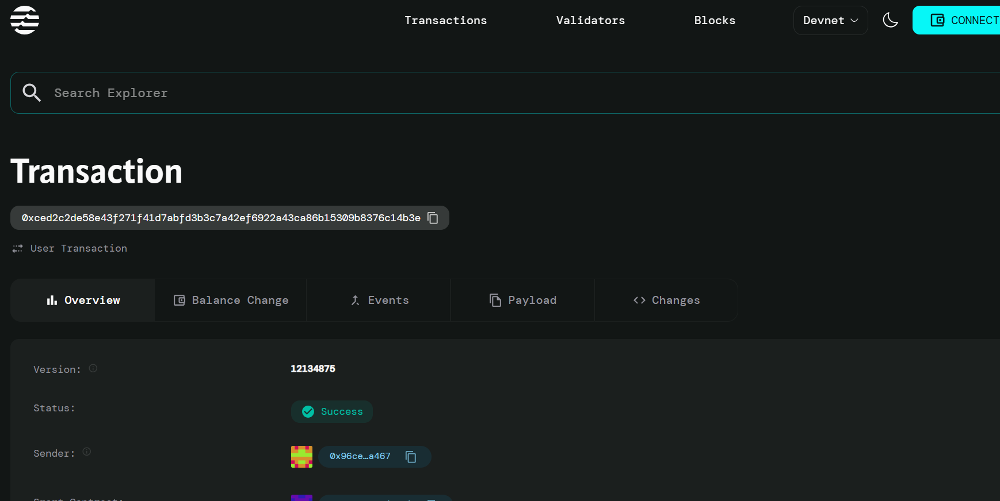

# Impermanent Loss Insurance

## Project Description
Implement protection against liquidity provider losses through a decentralized insurance mechanism. This smart contract allows liquidity providers to purchase insurance policies that protect them against impermanent loss when providing liquidity to automated market makers (AMMs). The system enables users to pay premiums upfront and claim compensation when they experience losses due to price divergence between paired assets.

## Project Vision
To create a robust and trustless insurance ecosystem that protects DeFi liquidity providers from the inherent risks of impermanent loss, encouraging more participation in liquidity provision and strengthening the overall DeFi ecosystem. Our vision is to make liquidity provision safer and more predictable, reducing barriers to entry for new participants while providing peace of mind for existing liquidity providers.

## Key Features

### 🛡️ **Customizable Coverage**
- Flexible coverage percentages up to 80% of losses
- Tailored insurance policies based on individual risk tolerance
- Premium-based pricing model

### 💰 **Automated Compensation**
- Smart contract-based claim processing
- Transparent loss calculation and verification
- Instant compensation payments upon valid claims

### ⏱️ **Time-Stamped Policies**
- Policy activation tracking with blockchain timestamps
- Historical record of all insurance activities
- Comprehensive claim history for each policy holder

### 🔒 **Secure Premium Collection**
- Trustless premium payment system
- Funds held securely in smart contract
- Automated fund management and distribution

## Future Scope

### 📊 **Advanced Risk Assessment**
- Integration with price oracles for real-time asset valuation
- Dynamic premium calculation based on market volatility
- Risk scoring algorithms for different liquidity pools

### 🤝 **Multi-Pool Support**
- Support for multiple AMM protocols (Uniswap, SushiSwap, etc.)
- Cross-chain insurance coverage expansion
- Pool-specific risk parameters and pricing

### 📈 **Enhanced Analytics**
- Comprehensive dashboard for policy holders
- Loss prediction models and early warning systems
- Market trend analysis and risk reporting

### 🏛️ **Governance Integration**
- Decentralized governance for policy parameters
- Community-driven coverage limit adjustments
- Stake-based voting for protocol upgrades

### 🔄 **Automated Rebalancing**
- Smart contract integration with AMM protocols
- Automatic loss detection and claim initiation
- Real-time portfolio monitoring and alerts

## Contract Details
0xced2c2de58e43f271f41d7abfd3b3c7a42ef6922a43ca86b15309b8376c14b3e
